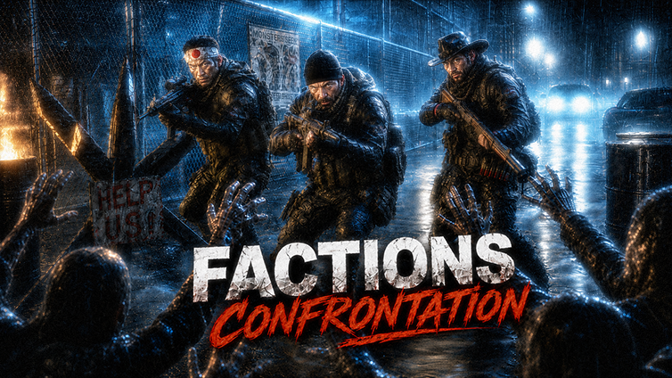

<p align="center">
  
</p>

<h1 align="center">Factions Confrontation</h1>

<p align="center">
  <b>A living-world NPC factions mod for Project Zomboid.</b><br>
  Faction bases, patrols, contracts, black market activity, tactical NPC behavior, persistent NPC state, and territorial conflict.
</p>

<p align="center">
  
  
  
  
</p>

---

## Overview

**Factions Confrontation** expands Project Zomboid with a persistent NPC faction layer.

The mod is built around dynamic survivor groups, faction-controlled locations, roaming patrols, black market systems, contracts, tactical combat behavior, background world simulation, and server-authoritative NPC state.

The goal is to make Knox Country feel contested and alive: factions occupy territory, move through the world, fight, trade, patrol, defend bases, create opportunities, and generate pressure around the player.

---

## Architecture Map

<p align="center">
  
</p>

The current architecture is split into clear gameplay and runtime layers:

* **Client Layer** — order UI, command batching, map markers, visual feedback, local NPC visualization, and client-side update bridges.
* **Shared AI / Core Layer** — NPC contracts, behavior decisions, tactical actions, state bridges, spatial indexing, AI LOD, scheduling, influence fields, and performance support.
* **Server Strategic Layer** — server-authoritative command validation, world simulation, faction bases, global squads, patrols, raids, NPC materialization, and synchronization.
* **Data and Persistence Layer** — ModData save roots, persistent NPC snapshots, inventories, death-loot state, faction/base state, order revisions, and equipment state.
* **Project Zomboid Runtime Layer** — the external game world, zombies, players, containers, vehicles, buildings, items, and selected bundled Java class overrides.

The main design principle is simple: **the player gives orders, the server remains authoritative, and the Mercenary Direct Pipeline controls hired mercenaries without mixing them into the generic NPC order channel.**

---

## Core Features

### Living Faction World

* Multiple NPC factions with different roles and hostility profiles.
* Dynamic faction bases, camps, checkpoints, patrol routes, raids, and world markers.
* Background world simulation through a dedicated World Director layer.
* Virtual groups and global squads that can materialize near the player.
* Faction activity designed for both single-player and COOP/server play.

### NPC Gameplay Systems

* Combat-capable NPCs with firearms, melee behavior, looting, movement, and tactical routines.
* Group behavior, leaders, loyalty, disguise, wanted/heat logic, radio intercepts, and faction documents.
* Convoys, bounty systems, contracts, signals, black market missions, and reward containers.
* Wounded NPC handling, persistence, post-combat recovery, and loot-related systems.
* Mercenary orders with follow, move, guard, patrol, loot, search, rearm, return, fire mode, and formation logic.

### Mercenary Direct Pipeline

The mod includes a dedicated order pipeline for hired mercenaries:

* Client creates command batches with revisions.
* Server validates the player, owner, hired group, and command batch.
* Follow orders bind to the player.
* Point-based orders use a cursor world anchor.
* Execution remains server-authoritative.
* Mercenary orders are isolated from the generic NPC order channel.

### Black Market and Contracts

* Black Market world object and interaction flow.
* Contract-based progression and reward logic.
* Defense and event hooks for faction-related black market activity.
* Persistent reward handling intended for server restarts and COOP sessions.
* Integration with bounty, convoy, checkpoint, counter-intel, heat/wanted, and intel dossier systems.

### Performance-Oriented Architecture

The project includes multiple optimization-oriented subsystems:

* AI LOD / reduced thinking depth for less relevant NPCs.
* Spatial indexing for nearby NPC, zombie, and world queries.
* Work scheduling and budgeted background updates.
* Runtime caches and throttled client/server update paths.
* Influence-field style world data for strategic decisions.
* Performance telemetry and regression guard modules.
* Java class patches for selected Project Zomboid runtime behavior and performance paths.

---

## Installation

### Steam Workshop

Subscribe to the mod on Steam Workshop when the public Workshop page is available, then enable it in the Project Zomboid mod menu.

### Manual Installation

Place the mod folder here:

```text
C:\Users\<YourUser>\Zomboid\Workshop\FactionsConfrontation\Contents\mods\FactionsConfrontation
```

Expected structure:

```text
FactionsConfrontation/
├── media/
├── mod.info
├── poster.png
└── README.md
```

Then enable **Factions Confrontation** in the Project Zomboid mod list.

---

## Multiplayer / COOP Notes

The mod contains separate client, server, and shared Lua layers. Server-side bridge modules handle world simulation, persistence, contracts, black market logic, checkpoints, convoys, faction economy, NPC state handling, world rules, materialization, and synchronization.

Recommended COOP/server checks after updating:

* Start a fresh server and verify that the mod loads without console errors.
* Spawn or encounter NPC groups and verify combat behavior.
* Give mercenary orders and confirm that follow, point orders, rearm, loot, and return work correctly.
* Restart the server and confirm that relevant persistent NPC/world state is restored.
* Check Black Market reward containers after restart.
* Verify faction bases, world markers, checkpoints, and contract interactions.
* Monitor server and client logs during NPC-heavy scenes.

---

## Repository Structure

```text
media/
├── AnimSets/             # Animation set overrides and NPC/zombie animation data
├── ENGINE_STAT/          # Development diagrams, audit reports, and architecture references
├── ProjectZomboid/       # Included Java class patches for selected runtime classes
├── lua/
│   ├── client/           # Client UI, rendering, commands, local NPC update logic
│   ├── server/           # Server world simulation, persistence, commands, factions
│   └── shared/           # Shared NPC core, AI, contracts, data, utilities
├── scripts/              # Item and script definitions
├── ui/                   # UI textures and world prop images
└── sandbox-options.txt   # Sandbox configuration entries
```

Key development files:

```text
media/lua/shared/PROJECT_MAP.md
media/lua/shared/PROJECT_MAP_UPDATE.md
```

These files are used as internal navigation and changelog references during development.

---

## Technical Design

The codebase uses bridge-style modules to stay compatible with the Project Zomboid Lua loading model while keeping boundaries clear:

| Layer            | Purpose                                                                            |
| ---------------- | ---------------------------------------------------------------------------------- |
| `client`         | UI, local rendering, order selection, local commands, client-side NPC updates      |
| `server`         | Persistence, world simulation, faction logic, command validation, server authority |
| `shared`         | NPC core systems, contracts, utilities, AI support, common data                    |
| `ProjectZomboid` | Selected Java runtime class patches bundled with the mod                           |
| `ENGINE_STAT`    | Architecture diagrams, audit notes, and development reference material             |

The project favors incremental, budgeted updates over heavy all-at-once work. Expensive systems should use scheduling, caching, throttling, spatial queries, or LOD gates whenever possible.

---

## Development Guidelines

When contributing or modifying the project:

* Preserve existing APIs, data formats, and save/network compatibility.
* Do not refactor unrelated systems as part of a bug fix.
* Keep client/server/shared responsibilities separated.
* Avoid heavy unthrottled `OnTick` / `OnUpdate` logic.
* Prefer cached, scheduled, or budgeted work for expensive NPC/world operations.
* Test both single-player and COOP/server behavior.
* Check nil/empty values, server/client command boundaries, ModData usage, and event registration order.
* Keep changes minimal, controlled, and easy to review.

---

## Current Status

Factions Confrontation is under active development. Gameplay systems, NPC behavior, persistence, server stability, performance, and multiplayer reliability are still being improved.

Expect frequent internal changes while the mod continues moving toward a more stable public release.

---

## Credits

Created and maintained by **CARL REAPER SHEPPARDS** and **Error 404 | Skill not found**.

Built for the Project Zomboid modding community.

---

## Disclaimer

This is an unofficial Project Zomboid mod. It is not affiliated with, endorsed by, or sponsored by The Indie Stone.

## Documentation / Wiki

- [English Wiki](media/docs/WIKI.md)
- [усская Wiki](media/docs/WIKI_RU.md)

