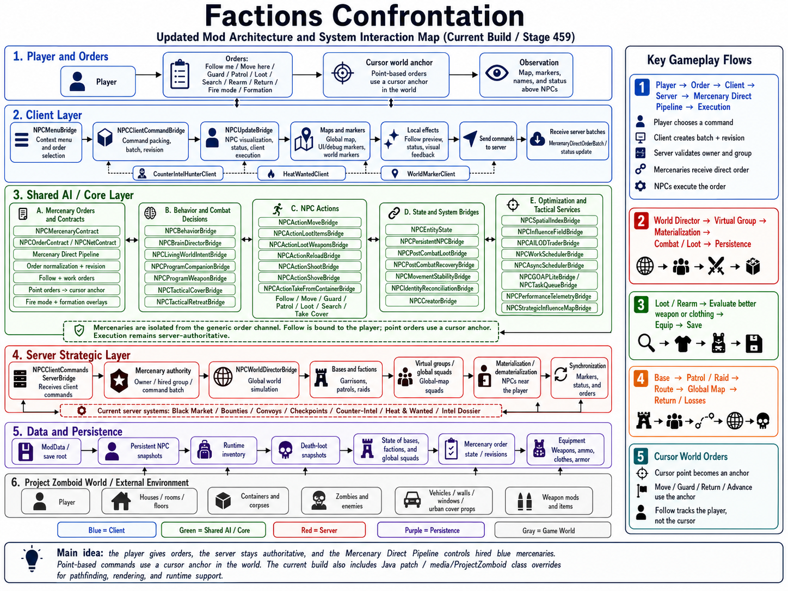

# Factions Confrontation — Wiki на русском

> усскоязычная wiki-страница для игроков, администраторов серверов и разработчиков мода **Factions Confrontation**.

  

---

## Содержание

- [то такое Factions Confrontation](#что-такое-factions-confrontation)
- [раткий старт](#краткий-старт)
- [сновной игровой цикл](#основной-игровой-цикл)
- [Фракции NPC](#фракции-npc)
- [аёмники и приказы](#наёмники-и-приказы)
- [ёрный рынок и контракты](#чёрный-рынок-и-контракты)
- [азы, патрули, рейды и глобальные отряды](#базы-патрули-рейды-и-глобальные-отряды)
- [ерсистентность и COOP](#персистентность-и-coop)
- [роизводительность](#производительность)
- [роверка после обновления](#проверка-после-обновления)
- [арта файлов для разработки](#карта-файлов-для-разработки)
- [FAQ](#faq)

---

## то такое Factions Confrontation

**Factions Confrontation** — это мод для **Project Zomboid**, который добавляет в мир слой живых NPC-фракций.

од строится вокруг враждебных и нейтральных групп выживших, баз фракций, патрулей, контрактов, чёрного рынка, тактического поведения NPC, лута, персистентности и фоновой симуляции мира.

лавная цель — сделать Knox Country более живым и конфликтным. Фракции не просто появляются как случайные встречи: они могут занимать территории, защищать базы, отправлять патрули, участвовать в рейдах, создавать угрозы, торговать, оставлять награды и влиять на происходящее вокруг игрока.

---

## раткий старт

1. Установи мод.
2. ключи его в списке модов Project Zomboid.
3. Создай новый мир или запусти COOP/сервер.
4. роверь, что в консоли нет критических ошибок.
5. айди NPC, базу, патруль, чёрный рынок или фракционную активность.
6. ля COOP/сервера после проверки сделай рестарт и убедись, что важные состояния восстановились.

---

## сновной игровой цикл

Типичный игровой цикл мода:

1. грок встречает NPC, группу, базу, патруль или объект чёрного рынка.
2. Фракции действуют в мире: защищают базы, перемещаются, вступают в бой, теряют людей, собирают лут.
3. Серверный **World Director** управляет глобальной симуляцией.
4. ядом с игроком виртуальные группы могут материализоваться в реальных NPC.
5. осле боя NPC могут лутать, переодеваться, искать оружие, восстанавливаться или сохранять своё состояние.
6. асть данных сохраняется через `ModData` и восстанавливается после перезапуска.

---

## Фракции NPC

од поддерживает несколько типов NPC-фракций и групп. ни могут отличаться поведением, агрессивностью, экипировкой, ролью и отношением к игроку.

сновные элементы фракционного мира:

- базы и лагеря;
- гарнизоны;
- патрули;
- рейды;
- глобальные отряды;
- лидеры;
- лояльность;
- маскировка;
- документы фракций;
- радиоперехваты;
- система heat/wanted;
- контракты и события.

---

## аёмники и приказы

 моде есть отдельный pipeline для приказов наёмникам.

оддерживаемые типы приказов:

- Follow me;
- Move here;
- Guard;
- Patrol;
- Loot;
- Search;
- Rearm;
- Return;
- Fire mode;
- Formation.

аёмники отделены от общего канала приказов NPC. то снижает риск конфликтов между обычным поведением NPC и командами игрока.

### ак работают приказы

1. грок выбирает команду через клиентский интерфейс.
2. лиент формирует пакет приказа.
3. Сервер проверяет владельца, группу и актуальность команды.
4. Сервер отдаёт приказ группе наёмников.
5. NPC выполняют команду авторитетно со стороны сервера.

### Follow и point-based приказы

- **Follow** привязывается к игроку.
- **Move / Guard / Return / Advance** используют точку курсора как world anchor.
- Точка курсора сохраняется как якорь приказа в мире.

---

## ёрный рынок и контракты

ёрный рынок — отдельная система взаимодействий, наград и контрактов.

н может включать:

- объект чёрного рынка в мире;
- контракты;
- награды;
- reward container;
- события защиты;
- связь с фракционными системами;
- интеграцию с bounty, convoys, checkpoints, counter-intel, heat/wanted и intel dossier.

ля COOP особенно важно проверять, что контейнеры наград не очищаются после рестарта сервера, если внутри есть лут.

---

## азы, патрули, рейды и глобальные отряды

**World Director** управляет стратегическим слоем:

- базами;
- гарнизонами;
- патрулями;
- рейдами;
- глобальными группами;
- виртуальными отрядами;
- материализацией NPC рядом с игроком;
- дематериализацией дальних NPC;
- синхронизацией маркеров и статусов.

дея системы: не держать весь мир активным одновременно. альние группы могут существовать как виртуальные данные, а рядом с игроком превращаться в реальных NPC.

---

## ерсистентность и COOP

од содержит отдельные `client`, `server` и `shared` Lua-слои.

Сервер отвечает за:

- состояние мира;
- команды;
- фракции;
- базы;
- контракты;
- чёрный рынок;
- NPC-состояния;
- сохранение данных;
- восстановление после рестарта;
- синхронизацию с клиентами.

то нужно проверять после рестарта сервера:

- живые материализованные NPC рядом с игроком;
- важные persistent NPC;
- состояние баз;
- состояние фракций;
- активные контракты;
- reward containers;
- маркеры;
- группы на глобальной карте.

---

## роизводительность

од использует несколько оптимизационных систем:

- AI LOD;
- spatial indexing;
- work scheduler;
- async scheduler;
- runtime cache;
- influence fields;
- throttled updates;
- budgeted world simulation;
- Java class overrides для некоторых runtime-путей Project Zomboid.

лавная идея оптимизации: тяжёлая логика не должна выполняться каждый тик без ограничений. орогие задачи должны распределяться по времени, кэшироваться или выполняться только рядом с игроком.

---

## роверка после обновления

осле каждого крупного обновления рекомендуется проверить:

1. од загружается без ошибок в SP.
2. од загружается без ошибок в COOP/MP.
3. NPC появляются и не зависают массово.
4. NPC атакуют врагов и реагируют на угрозы.
5. аёмники получают и выполняют команды.
6. Follow работает именно по игроку.
7. Move/Guard/Return используют точку курсора.
8. ёрный рынок открывается и выдаёт награды.
9. онтейнеры наград сохраняются после рестарта.
10. азы, патрули и маркеры отображаются корректно.
11.  консоли нет спама ошибок.
12. FPS не проседает критически при нескольких NPC на экране.

---

## арта файлов для разработки

сновные файлы навигации:

- `media/lua/shared/PROJECT_MAP.md`
- `media/lua/shared/PROJECT_MAP_UPDATE.md`

сновные слои:

- `media/lua/client/`
- `media/lua/server/`
- `media/lua/shared/`

лючевые серверные системы:

- `media/lua/server/NPCServer/NPCWorldDirectorBridge.lua`
- `media/lua/server/NPCServer/NPCClientCommandsServerBridge.lua`
- `media/lua/server/NPCServer/NPCBaseCampServerBridge.lua`
- `media/lua/server/NPCServer/NPCBlackMarketServerBridge.lua`

лючевые shared/core системы:

- `media/lua/shared/NPCCore/NPCWorkSchedulerBridge.lua`
- `media/lua/shared/NPCCore/NPCSpatialIndexBridge.lua`
- `media/lua/shared/NPCCore/NPCAILODTraderBridge.lua`
- `media/lua/shared/NPCCore/NPCInfluenceFieldBridge.lua`
- `media/lua/shared/NPCCore/NPCPersistentNPCBridge.lua`

лючевые client-системы:

- `media/lua/client/NPCClient/NPCMenuBridge.lua`
- `media/lua/client/NPCClient/NPCClientCommandBridge.lua`
- `media/lua/client/NPCClient/NPCUpdateBridge.lua`
- `media/lua/client/NPCClient/NPCDebugMapMarkersBridge.lua`

---

## FAQ

### ужно ли начинать новый мир?

ля крупных обновлений желательно тестировать на новом мире. ля обычной проверки можно использовать существующий save, но при странных ошибках сначала нужно проверить новый мир.

### аботает ли мод в COOP?

од проектируется с разделением client/server/shared и поддержкой COOP/MP, но после каждого обновления нужно проверять серверные логи, рестарт сервера и восстановление важных состояний.

### очему NPC иногда материализуются рядом с игроком?

то часть архитектуры: дальние группы могут существовать как виртуальные данные, а рядом с игроком превращаться в реальных NPC, чтобы не держать весь мир активным одновременно.

### очему важны scheduler, LOD и spatial index?

отому что NPC-логика дорогая. сли каждый NPC будет выполнять тяжёлую логику каждый тик, появятся фризы, просадки FPS и серверные лаги. Scheduler, LOD и spatial index уменьшают нагрузку.

### то делать при ошибках в консоли?

ужно сохранить:

- `console.txt`;
- `coop-console.txt` или server log;
- описание условий;
- сколько NPC было рядом;
- SP или COOP;
- новый мир или старый save;
- список активных модов.

---

## Languages

- [English version](WIKI.md)

---

## Статус

од находится в активной разработке. оведение NPC, стабильность, производительность, COOP/MP и персистентность продолжают улучшаться.
